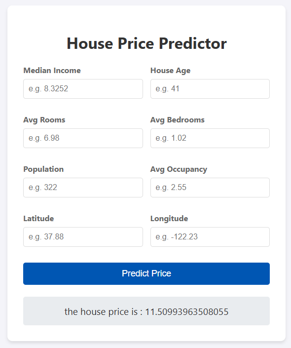

## 🏠 California House Price Predictor

This repository contains a full-stack web application for predicting house prices in California using a machine learning model. The application is built with **Flask** for the backend, **scikit-learn** for the machine learning model, and a simple HTML/CSS frontend for interaction.

---

### ✨ Features

* **House Price Prediction:** Predicts the median house value based on 8 input features.
* **Intuitive Web Interface:** A user-friendly form to input features and get the predicted price.
* **Production Ready:** Includes `Dockerfile` and `Procfile` for containerization and deployment (e.g., to Heroku or similar platforms).

### 🛠️ Technologies Used

The project leverages the following key technologies and libraries:

| Category | Technology/Library | Description |
| :--- | :--- | :--- |
| **Backend Framework** | **Flask** | The web framework used to handle routing and serve the prediction model. |
| **Machine Learning** | **scikit-learn** | Used for training the model and for saving/loading the prediction pipeline (`regmodel.pkl` and `scaling.pkl`). |
| **Data Handling** | **pandas**, **numpy** | Used for data manipulation, cleaning, and preparation during the model training phase. |
| **Data Visualization** | **matplotlib**, **seaborn** | Used for exploratory data analysis (EDA) during model development (as seen in `ML_pipeline_california_DS.ipynb`). |
| **Web Server** | **gunicorn** | A WSGI HTTP Server for UNIX, used to run the Flask application in production. |

### 🚀 Getting Started

#### Prerequisites

* Python 3.x
* Git

#### Installation and Setup

1.  **Clone the repository:**
    ```bash
    git clone [Your Repository URL]
    cd [Your Repository Folder Name]
    ```

2.  **Create a virtual environment (recommended):**
    ```bash
    python -m venv venv
    source venv/bin/activate  # On Windows, use `venv\Scripts\activate`
    ```

3.  **Install the required dependencies:**
    ```bash
    pip install -r requirements.txt
    ```

4.  **Run the Flask application:**
    ```bash
    python app.py
    ```

    The application will typically be available at `http://127.0.0.1:5000/`.

### 🌐 Web Application Interface

The application provides a clean interface for users to input the necessary features.




---

### 📂 Repository Structure

The key files and directories in this repository are:

* **`app.py`**: The main Flask application file that handles the web routes, loads the trained model, and performs predictions.
* **`regmodel.pkl`**: The trained machine learning model (likely a linear regression or similar model) saved using `pickle`.
* **`scaling.pkl`**: The fitted scaler object (e.g., `StandardScaler`) used to preprocess input data before prediction. This ensures the web input is transformed exactly as the training data was.
* **`templates/`**: Contains the HTML files (e.g., `index.html`) for the frontend user interface.
* **`requirements.txt`**: Lists all the Python dependencies needed to run the project.
* **`Dockerfile`**: Defines the steps to build a Docker image for the application.
* **`Procfile`**: Specifies the command to run the application on a platform like Heroku using `gunicorn`.
* **`ML_pipeline_boston_DS.ipynb`**: (Note: Despite the name, this notebook was used to develop and train the model/pipeline, using the **California Housing Dataset**, and save the `.pkl` files).

### ⚙️ Deployment

This application is ready for deployment using Docker or a platform like Heroku.

* **Docker:** Build and run the container:
    ```bash
    docker build -t california-house-predictor .
    docker run -p 5000:5000 california-house-predictor
    ```

* **Heroku/Similar Platforms:** The included `Procfile` and `requirements.txt` are configured for a Gunicorn web server deployment.

---

### 📈 California Housing Dataset

The model was trained on the **California Housing Dataset**, which contains data on house prices, median income, house age, and other geographical and structural features for various districts in California.
